  

Я разработчик, увлекающийся созданием удобных и красивых приложений. Всегда открыт к изучению новых технологий и решению интересных задач.

## 🛠 Мой стек технологий

  
  
  
  
  

## 🚀 Недавние проекты
* **Погодное приложение** — работа с API и стилизация компонентов на React.
* **Планировщик задач** — приложение на чистом JavaScript для удобного управления делами.
* **Геометрические фигуры** — консольная программа на C++ с использованием ООП и иерархии классов.

## 📊 Статистика GitHub

  
  

